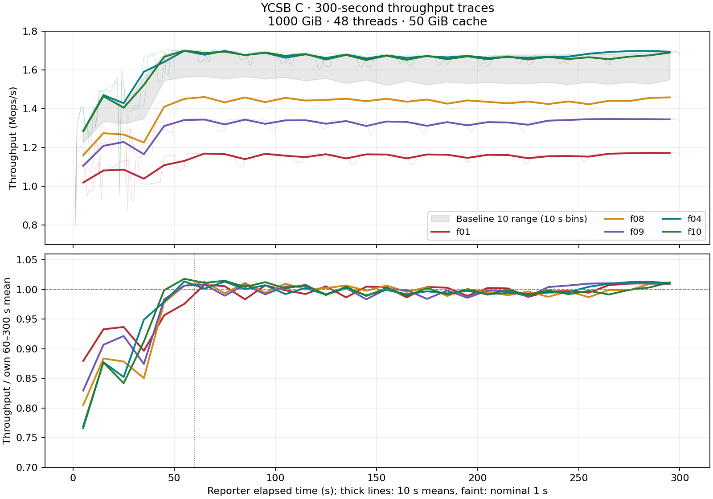

# Original baseline 10 / pre-membership F2Load f01–f10: I/O and throughput-time audit

2026-09-14에 기존 로그만 분석했다. 신규 로딩·YCSB 측정·DB open은 하지 않았다. 기존 120개 측정과 평균, f01 포함 여부를 변경하지 않았다. 이 묶음은 RocksDB 실험이며, 별도로 진행 중인 Pebble no-membership 로딩과 구분한다.

조건: 1000 GiB 입력, 1,048,576,000 records, key 24 B + value 1000 B, 48 threads, 50 GiB cache, 각 YCSB A–F 300 s, direct reads, Zipfian (D는 Latest), seed 87654321. 정확한 실행 명령은 commands.json, 원본별 manifest와 로그 SHA-256은 manifest.json에 있다. profiler commit dbb0a44a65344f263356c507ec09762c8ed81a71, binary SHA-256 20d67c38612cee9a34d9ef7114c81bc8366b2d4cf99c598b642e63f21ab74266.

**관찰: C의 낮은 처리량은 실행 중 잠깐 급락한 결과가 아니라, 초기 상승 구간 이후에도 지속되는 실행 간 차이다.** 외부 작업이 측정 내내 실행되었다면 이런 패턴이 가능하므로 외부 간섭을 배제하지 않는다. 시간에 따른 처리량만으로 다른 프로세스의 존재나 원인을 확정할 수 없다.

아래는 1초 reporter 기록을 60초씩 묶은 평균이다. 단위는 Mops/s. 초기 60초를 별도로 보는 것은 패턴 설명용이며 원래 300초 측정치를 대체하지 않는다.

| C arm | 0–60 s | 60–120 s | 120–180 s | 180–240 s | 240–300 s | 60–300 s 변동계수 |
|---|---:|---:|---:|---:|---:|---:|
| f01 | 1.078 | 1.159 | 1.158 | 1.156 | 1.166 | 1.29% |
| f08 | 1.298 | 1.448 | 1.445 | 1.432 | 1.443 | 1.17% |
| f09 | 1.227 | 1.335 | 1.325 | 1.327 | 1.346 | 1.30% |
| f04 | 1.519 | 1.681 | 1.668 | 1.666 | 1.689 | 1.17% |
| f10 | 1.507 | 1.684 | 1.664 | 1.662 | 1.669 | 1.16% |

원본 C 20개 모두 60초 이후의 nominal 1초 처리량이 각자 같은 구간 중앙값보다 10% 이상 낮은 표본은 0개다. 이는 기술적 요약 기준일 뿐 유의성 검정이나 이상치 제거 규칙은 아니다. 60초 이후의 30초 평균 범위는 f01 1.154–1.172 Mops/s, f08 1.430–1.452 Mops/s, f09 1.324–1.346 Mops/s다. 정상 속도의 f04는 1.666–1.697 Mops/s다.



실제 프로세스 실행 UTC는 f01 9월 11일 02:53:49–02:58:53, f08 같은 날 22:39:12–22:44:17, f09 23:11:16–23:16:20이다. f06–f10 경로명의 260912는 이 C 실행들의 UTC 날짜와 다르다. 전체 시각은 throughput_C_minutes.tsv와 C_campaign_UTC.png에 보존했다. A–F는 처리량 규모와 연산 구성이 다르므로 한 시간 평균에 섞지 않았다.

**장치 평균 read latency는 낮은 throughput을 설명할 만큼 증가하지 않았다.** 31개 RAID0 NVMe 멤버의 완료 read 수로 가중한 평균이며 OS 장치 nvme0n1은 제외했다.

| C arm | Throughput (Mops/s) | NVMe mean read await (µs) | Engine SST read p99 (µs) | Process kernel CPU (µs/YCSB op) |
|---|---:|---:|---:|---:|
| f01 | 1.143 | 68.362 | 131.93 | 12.09 |
| f08 | 1.413 | 67.643 | 109.20 | 4.81 |
| f09 | 1.312 | 67.589 | 109.18 | 7.12 |
| f04 | 1.645 | 67.704 | 109.22 | 2.41 |
| f10 | 1.637 | 67.651 | 109.18 | 2.45 |

Baseline C의 장치 평균 read await 범위도 67.620–68.420 µs다. f01의 SST read p99 상승은 실제 관찰되지만 f08/f09에는 같은 상승이 없다. SST read p99는 RocksDB가 계측한 파일 읽기 히스토그램이며 **블록 디바이스 p99가 아니다**. 기존 plot_baseline_band.py 주석의 “device read p99 132/137/155 µs” 표현은 실제로 이 엔진 히스토그램을 가리킨다. 장치 read p99는 당시 저장하지 않았다.

장치 %util은 빠른/느린 C 실행 모두 60개 5초 구간 중 58개에서 멤버 평균 99% 이상이다. 현대 SSD와 RAID는 병렬 요청을 처리하므로 %util≈100%만으로 성능 한계 도달을 판단할 수 없다. [sysstat iostat 공식 문서](https://github.com/sysstat/sysstat/blob/master/man/iostat.in). 또한 md0의 latency/busy counter는 0이고 NVMe weighted-I/O counter도 유효하게 증가하지 않아 aqu-sz는 사용할 수 없다. TSV에서 사용할 수 없는 큐 깊이와 장치 p99는 빈 칸으로 표기했다. 디바이스 포화를 확실히 배제했다는 결론도 내릴 수 없다.

f01/f08/f09는 benchmark 자체의 커널 CPU 비용이 증가했다. 이 값은 GNU time의 전체 프로세스 system CPU 초를 YCSB 완료 연산 수로 나눈 값이다. DB open/close 비용을 포함하며 개별 연산의 wall latency나 순수 syscall latency가 아니다. 커널 stack profile이 없으므로 scheduler, lock, cache/NUMA 또는 외부 작업 중 무엇이 원인인지 확정하지 않았다. filter checks/Get도 f04 3.25에서 f01 4.25, f08 4.17, f09 4.11로 달라져 DB/engine 측 작업량 차이도 남아 있다.

**외부 작업 확인의 한계:** C 20개 실행의 600개 monitor.jsonl 표본 모두 해당 실행의 singleton benchmark PID를 유지했다. 당시 active_benchmarks()는 db_bench/titandb_bench만 pgrep했으며, Python/cp/일반 프로세스의 ps/pidstat, CPU, I/O 시계열은 저장하지 않았다. 따라서 “추가로 기록된 benchmark 없음”까지 확인되며 “다른 작업 없음”으로 해석할 수 없다. 기존 plot_baseline_band.py의 f01 외부 작업 설명은 실험자 보고를 보존한 기록이지 다른 PID를 특정한 독립 계측 자료가 아니다.

시각·단위 해석: report.rep의 interval_qps는 약 1초마다 완료한 작업 수 차분이다. 정확한 interval duration으로 정규화하지 않으며 secs_elapsed도 reporter thread 시작부터 반올림한 값이다. iostat은 process 시작 근처에서 별도로 시작하고 절대시각 옵션이 없으므로 1초 수준의 정확한 상관 정렬은 주장하지 않았다. iostat 첫 보고서는 부팅 이후 평균이라 제외했다. r02/f06 C는 완료된 299개 표본만 있어서 마지막 일부 구간을 만들어 채우지 않았다. CPU 환경은 48개 online CPU이며 iostat의 96 CPU header로 비율을 재계산하지 않았다.

**재측정 상태:** 새로운 YCSB를 시작하지 않았다. 원본 f01–f10 DB와 C clone, baseline 10의 물리 복사 DB와 C clone이 현재 기록된 경로에 모두 없다. 원래 baseline run3 DB는 남아 있지만 당시 별도 물리 복사본과 저장 위치가 다르다. 따라서 기존의 느린 DB 그대로 반복하는 것은 불가능하며, 재로딩 후 비교하면 별도의 새 cohort다. 현재 증거만으로 기존 결과를 디바이스 포화로 판정해 교체하지 않았다. 향후 원인 확인을 위한 새 실험에서는 전체 프로세스별 CPU/I/O 시계열과 커널 profile을 함께 수집해야 한다.

파일: io_latency_all_af.tsv (120개 I/O·engine·CPU), io_latency_C.tsv (C 20개), workload_summary.tsv (A–F arm별 평균/범위), throughput_30s_60s_all_af.tsv, throughput_C_minutes.tsv, C_all_10_time_traces.png, C_campaign_UTC.png, C_process_monitor_audit.json, rerun_feasibility.json. 원본 1초 값과 전체 5초 device 표본은 Git-ignored experiments/artifacts/analysis/20260914-081500_pre_membership_io_latency/에 있다.

재현 (vcomp/에서, 로그 경로가 남아 있는 서버):

```bash
python3 experiments/analysis/parse_pre_membership_device_io.py --output experiments/artifacts/analysis/20260914-081500_pre_membership_io_latency/device_audit.json
python3 experiments/analysis/export_pre_membership_io_latency.py --device-audit experiments/artifacts/analysis/20260914-081500_pre_membership_io_latency/device_audit.json --feasibility-audit experiments/results/20260914-081500_pre_membership_io_latency/rerun_feasibility.json --output-dir experiments/results/20260914-081500_pre_membership_io_latency
python3 experiments/analysis/export_pre_membership_throughput_time.py --io-bundle experiments/results/20260914-081500_pre_membership_io_latency --raw-output-dir experiments/artifacts/analysis/20260914-081500_pre_membership_io_latency
```
